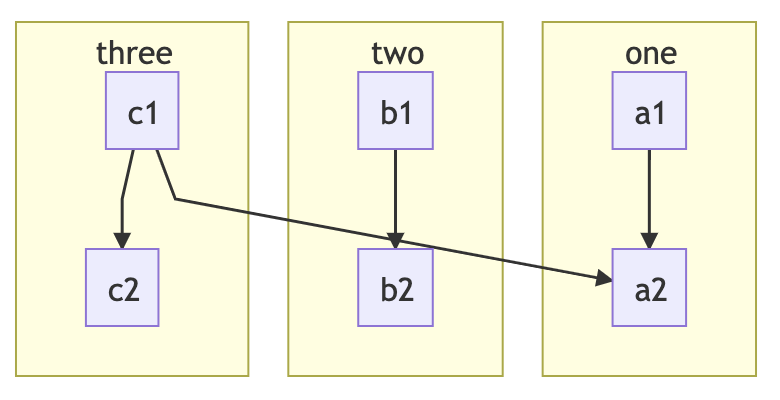

# 高级美人鱼笔记

## 概述

!!! warning "支持"

    这是为了帮助用户获得美人鱼运行，但我们没有正式提供美人鱼的技术支持。
    遇到的任何问题都需要用户自己调试。

    使用较旧或较新版本的Mermaid可能会出现问题，也可能不会出现问题。
    我们可能并不总是跟上最新和最伟大的美人鱼版本。

    我们很乐意接受拉请求，提供改进的东西在这里或纠正错误信息。

在[superences](../extensions/superfences.md)中，我们介绍了[custom fences](../extensions/superfences.md#custom-fences)，并提供了一个使用[Mermaid diagrams](../extensions/superfences.md#uml-diagram-example)的示例。
我们在示例中显示的是获得Mermaid工作所需的最低限度。
虽然我们的例子主要是为了指导用户如何使用自定义围栏，但我们并不打算对如何以最好的方式设置和工作美人鱼进行深入的解释。
老实说，Mermaid有一点缺陷，需要一些变通方法来缓解一些怪癖。

一般来说，我们会设置自定义栅栏供用户探索，但我们偶尔会被问到如何让Mermaid工作，以及我们在做什么，所以我们认为我们应该分享一些额外的信息，以防我们的任何用户都强烈希望实现一个健壮的美人鱼解决方案。

如果您想确切地了解我们所做的工作，您可以签出我们的源代码，但在本例中，我们将展示基础知识。

## 实际的图

有一些图表我们觉得不太适合我们，我们认为分享原因是有用的。
主要原因是由于大小和缩放问题，一些图表使用起来有点不切实际。
虽然可能有一种方法可以使它们工作，但我们目前还没有在这些图的变通方法上投入任何时间。

如果将一些不太实际的示例预渲染并作为图像包含，则可能效果更好。
这似乎就是Mermaid在他们自己的[文档][mermaid]中所做的。

!!! success "Practical"

    === "Flowcharts"
        ```diagram
        graph TD
            A[Hard] -->|Text| B(Round)
            B --> C{Decision}
            C -->|One| D[Result 1]
            C -->|Two| E[Result 2]
        ```

    === "Sequence Diagrams"
        ```diagram
        sequenceDiagram
            participant Alice
            participant Bob
            Alice->>John: Hello John, how are you?
            loop Healthcheck
                John->>John: Fight against hypochondria
            end
            Note right of John: Rational thoughts <br/>prevail!
            John-->>Alice: Great!
            John->>Bob: How about you?
            Bob-->>John: Jolly good!
        ```

    === "Class Diagrams"
        ```diagram
        classDiagram
            Class01 <|-- AveryLongClass : Cool
            Class03 *-- Class04
            Class05 o-- Class06
            Class07 .. Class08
            Class09 --> C2 : Where am i?
            Class09 --* C3
            Class09 --|> Class07
            Class07 : equals()
            Class07 : Object[] elementData
            Class01 : size()
            Class01 : int chimp
            Class01 : int gorilla
            Class08 <--> C2: Cool label
        ```

    === "Entity Relationships"
        ```diagram
        erDiagram
            CUSTOMER ||--o{ ORDER : places
            ORDER ||--|{ LINE-ITEM : contains
            CUSTOMER }|..|{ DELIVERY-ADDRESS : uses
        ```

    === "State Diagrams"
        ```diagram
        stateDiagram
            [*] --> First
            First --> Second
            First --> Third

            state First {
                [*] --> fir
                fir --> [*]
            }
            state Second {
                [*] --> sec
                sec --> [*]
            }
            state Third {
                [*] --> thi
                thi --> [*]
            }
        ```

    === "Git Graph"

        ```diagram
        gitGraph
            commit
            branch hotfix
            checkout hotfix
            commit
            branch develop
            checkout develop
            commit id:"ash" tag:"abc"
            branch featureB
            checkout featureB
            commit type:HIGHLIGHT
            checkout main
            checkout hotfix
            commit type:NORMAL
            checkout develop
            commit type:REVERSE
            checkout featureB
            commit
            checkout main
            merge hotfix
            checkout featureB
            commit
            checkout develop
            branch featureA
            commit
            checkout develop
            merge hotfix
            checkout featureA
            commit
            checkout featureB
            commit
            checkout develop
            merge featureA
            branch release
            checkout release
            commit
            checkout main
            commit
            checkout release
            merge main
            checkout develop
            merge release
        ```

    === "Journey"

        ```diagram
        journey
            title My working day
            section Go to work
              Make tea: 5: Me
              Go upstairs: 3: Me
              Do work: 1: Me, Cat
            section Go home
              Go downstairs: 5: Me
              Sit down: 5: Me
        ```

!!! fail "Impractical"

    === "Gantt"

        Gantt charts usually are too big to render properly in a page. If the element is big enough to hold it, and the
        chart is large, they render too small to see. If the element is not wide enough, the chart can sometimes render
        squished and hard to read.

        ```diagram
        gantt
            dateFormat  YYYY-MM-DD
            title Adding GANTT diagram to mermaid
            excludes weekdays 2014-01-10

            section A section
            Completed task            :done,    des1, 2014-01-06,2014-01-08
            Active task               :active,  des2, 2014-01-09, 3d
            Future task               :         des3, after des2, 5d
            Future task2               :         des4, after des3, 5d
        ```

    === "Pie"

        Pie at times can seem to work great, but other times it can be hard to read or missing labels all together.
        Like the others in this list, it relates to sizing and scaling. For instance, if you were to view this on a
        mobile device, you'd likely see the key for the pie chart missing.

        ```diagram
        pie
            title Key elements in Product X
            "Calcium" : 42.96
            "Potassium" : 50.05
            "Magnesium" : 10.01
            "Iron" :  5
        ```

## 配置

我们通过初始化API命令做一些配置来稍微调整图表。
这包括主题化和禁用有问题的功能。

我们通常包括Mermaid库，但在以非标准方式包装图表时使用自定义加载器。
此外，我们的自定义加载器允许我们解决使用Mermaid默认加载器时出现的一些问题。

为了便于说明，我们在下面提供了一个基本的、最小的配置。

```js
window.mermaidConfig = {
  startOnLoad: false,
  theme: "default",
  flowchart: {
    htmlLabels: false,
    useMaxWidth: false
  },
  er: {
    useMaxWidth: false
  },
  sequence: {
    useMaxWidth: false,
    noteFontWeight: "14px",
    actorFontSize: "14px",
    messageFontSize: "16px"
  },
  journey: {
    useMaxWidth: false
  },
  gitGraph: {
    useMaxWidth: false
  }
}
```

!!! note "Configuration Notes"

    1. We disable `htmlLabels` in flowcharts as we've had issues with it in the past. It may or may not be okay to
       enable. Your mileage may vary.

    2. If the option is available in a diagram, we disable `useMaxWidth` as we prefer that our diagrams do not scale
       within their parent element, we rather them overflow with a scrollbar. You can leave these enabled if you like.
       Since we render our diagrams under a custom element with a shadow DOM, to get scrollbars, we simply enable
       `#!css overflow: auto` on the custom `diagram-div` element (under the host DOM, not the shadow DOM).

    3. We disable `startOnLoad` as we provide our own loader (for reasons we will get into later).

    4. We do a quite a bit of custom theme overrides. Most of this is done through the Mermaid configuration options:
       `theme`, `themeVariables`, and `themeCSS`. Most users would simply use one of the default themes via the `theme`
       option, so that is what we've shown above.

## 自定义加载程序

在使用Mermaid时，我们发现了一些问题，我们可以通过使用我们自己的自定义加载程序来解决。
加载器包含查找Mermaid图、转换它们、将它们包装在影子DOM中并将它们插入当前文档所需的所有逻辑。

为了使用加载器，它应该附加到一个`DOMContentLoaded`事件，只在文档加载后执行。
我们将逻辑绑定到loader函数中的这个事件，该函数检查是否加载了Mermaid库，只有加载了，我们才执行负载。

我们在美人鱼周围工作的问题如下:

!!! bug "Issues"

    1. 如果使用Mermaid的默认加载器，在选项卡界面或细节中发现的图表(其中的元素可能在页面加载时隐藏)并不总是以可见的大小呈现。
    2. Mermaid在他们的SVG图中使用id，如果您的页面上恰好有与他们使用的id相匹配的id，有时会导致冲突。
    3. Mermaid并不总是使用唯一的id。如果一个图碰巧具有相同的ID，并且隐藏在细节元素或选项卡界面中，则可能导致图的某些元素消失。

我们在自己的自定义加载程序中做了一些事情来解决这些问题。

!!! success "Solutions"

    1. Using the `#!html <body>` element as a parent, we attach a surrogate element to it and render the diagram there.
       Once rendered, we then insert the diagram back to where the original custom fence was. This ensures it renders
       under a visible parent, and renders at a normal size.

    2. We wrap each diagram in a shadow DOM element. This prevents ID leakage from one diagram to another or to the
       host.

Apart from the issues we were trying to solve, we also use a custom loader for personal aesthetics as we like to render
our diagrams in `#!html <pre><code>` tags. This allows us to render the diagrams as normal code blocks in the rare case
that we cannot load the Mermaid library from the specified CDN.

## 把它们放在一起

那么，把所有这些放在一起，我们就有了由superences生成的HTML。
在HTML中，我们包含了Mermaid库并提供了配置。
我们还有自定义加载器，它在加载文档时运行。

=== "Preview"
    

=== "HTML"
    ```html
    <!-- Pre/code generated by SuperFences -->
    <pre class="mermaid"><code>graph TB
        c1--&gt;a2
        subgraph one
        a1--&gt;a2
        end
        subgraph two
        b1--&gt;b2
        end
        subgraph three
        c1--&gt;c2
        end</code></pre>

    <!-- Include Mermaid script and user config -->
    <script src="https://unpkg.com/mermaid@9.1.7/dist/mermaid.min.js"></script>
    <script>
    window.mermaidConfig = {
      startOnLoad: false,
      theme: "default",
      flowchart: {
        htmlLabels: false
      },
      er: {
        useMaxWidth: false
      },
      sequence: {
        useMaxWidth: false,
        noteFontWeight: "14px",
        actorFontSize: "14px",
        messageFontSize: "16px"
      }
    }
    </script>
    ```

=== "JS"
    ```{.js .md-max-height}
    const uml = className => {

      // Custom element to encapsulate Mermaid content.
      class MermaidDiv extends HTMLElement {

        /**
        * Creates a special Mermaid div shadow DOM.
        * Works around issues of shared IDs.
        * @return {void}
        */
        constructor() {
          super()

          // Create the Shadow DOM and attach style
          const shadow = this.attachShadow({mode: "open"})
          const style = document.createElement("style")
          style.textContent = `
          :host {
            display: block;
            line-height: initial;
            font-size: 16px;
          }
          div.diagram {
            margin: 0;
            overflow: visible;
          }`
          shadow.appendChild(style)
        }
      }

      if (typeof customElements.get("diagram-div") === "undefined") {
        customElements.define("diagram-div", MermaidDiv)
      }

      const getFromCode = parent => {
        // Handles <pre><code> text extraction.
        let text = ""
        for (let j = 0; j < parent.childNodes.length; j++) {
          const subEl = parent.childNodes[j]
          if (subEl.tagName.toLowerCase() === "code") {
            for (let k = 0; k < subEl.childNodes.length; k++) {
              const child = subEl.childNodes[k]
              const whitespace = /^\s*$/
              if (child.nodeName === "#text" && !(whitespace.test(child.nodeValue))) {
                text = child.nodeValue
                break
              }
            }
          }
        }
        return text
      }

      // Provide a default config in case one is not specified
      const defaultConfig = {
        startOnLoad: false,
        theme: "default",
        flowchart: {
          htmlLabels: false
        },
        er: {
          useMaxWidth: false
        },
        sequence: {
          useMaxWidth: false,
          noteFontWeight: "14px",
          actorFontSize: "14px",
          messageFontSize: "16px"
        }
      }

      // Load up the config
      mermaid.mermaidAPI.globalReset()
      const config = (typeof mermaidConfig === "undefined") ? defaultConfig : mermaidConfig
      mermaid.initialize(config)

      // Find all of our Mermaid sources and render them.
      const blocks = document.querySelectorAll(`pre.${className}, diagram-div`)
      const surrogate = document.querySelector("html")
      for (let i = 0; i < blocks.length; i++) {
        const block = blocks[i]
        const parentEl = (block.tagName.toLowerCase() === "diagram-div") ?
          block.shadowRoot.querySelector(`pre.${className}`) :
          block

        // Create a temporary element with the typeset and size we desire.
        // Insert it at the end of our parent to render the SVG.
        const temp = document.createElement("div")
        temp.style.visibility = "hidden"
        temp.style.display = "display"
        temp.style.padding = "0"
        temp.style.margin = "0"
        temp.style.lineHeight = "initial"
        temp.style.fontSize = "16px"
        surrogate.appendChild(temp)

        try {
          mermaid.mermaidAPI.render(
            `_diagram_${i}`,
            getFromCode(parentEl),
            content => {
              const el = document.createElement("div")
              el.className = className
              el.innerHTML = content

              // Insert the render where we want it and remove the original text source.
              // Mermaid will clean up the temporary element.
              const shadow = document.createElement("diagram-div")
              shadow.shadowRoot.appendChild(el)
              block.parentNode.insertBefore(shadow, block)
              parentEl.style.display = "none"
              shadow.shadowRoot.appendChild(parentEl)
              if (parentEl !== block) {
                block.parentNode.removeChild(block)
              }
            },
            temp
          )
        } catch (err) {} // eslint-disable-line no-empty

        if (surrogate.contains(temp)) {
          surrogate.removeChild(temp)
        }
      }
    }

    // This should be run on document load
    document.addEventListener("DOMContentLoaded", () => {uml("mermaid")})
    ```

!!! tip "Live Example"
    要了解一个实际的工作示例，请查看CodePen[在这里](https://codepen.io/facelessuser/pen/oNeNydQ).

## 在MkDocs中使用

如果你使用的是MkDocs，你可能会包括你的配置，美人鱼库，然后是你的加载器:

```yaml
markdown_extensions:
  - pymdownx.superfences:
      preserve_tabs: true
      custom_fences:
        # Mermaid diagrams
        - name: mermaid
          class: mermaid
          format: !!python/name:pymdownx.superfences.fence_code_format

extra_javascript:
  - optionalConfig.js
  - https://unpkg.com/mermaid@9.1.7/dist/mermaid.min.js
  - extra-loader.js
```

然后在你的文档中，这样做:

````

````

要在文档中直接嵌入这样的内容:

```diagram
graph TD
    A[Hard] -->|Text| B(Round)
    B --> C{Decision}
    C -->|One| D[Result 1]
    C -->|Two| E[Result 2]
```
